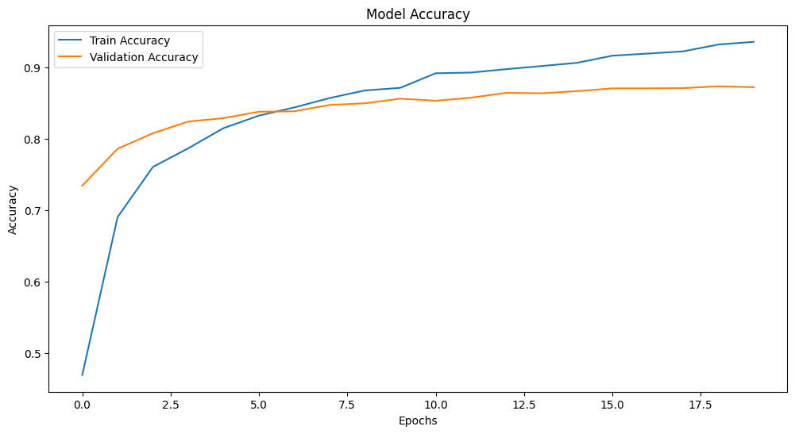

# Klasifikasi Sampah dengan Deep Learning

## Deskripsi Proyek

 Ini merupakan aplikasi berbasis web untuk klasifikasi sampah menggunakan model deep learning. Aplikasi ini membantu pengguna untuk mengenali jenis sampah berdasarkan gambar yang diunggah atau diambil melalui kamera perangkat. Klasifikasi dilakukan menjadi enam kategori utama:

- Kaca
- Kardus
- Kertas
- Logam
- Plastik
- Residu

### Tujuan Pengembangan

1. Meningkatkan kesadaran tentang pengelompokan sampah untuk mendukung daur ulang.
2. Memberikan alat berbasis AI yang mudah digunakan untuk mengenali jenis sampah.
3. Mengintegrasikan teknologi deep learning dengan antarmuka yang ramah pengguna.

---

## Langkah Instalasi

Ikuti langkah-langkah berikut untuk menginstal dependencies dan menjalankan aplikasi web:

### 1. Clone Repository

Clone repositori ini ke komputer Anda:

```bash
git clone https://github.com/pocariiii/uap.git
cd uap
```

### 2. Instal Dependencies

Instal semua dependencies yang diperlukan dengan perintah berikut:

```bash
pip install -r requirements.txt
```
di dalam file `requirements.txt` berisi library dibawah ini
```
streamlit
tensorflow
pandas
pillow
altair
```

### 3. Jalankan Aplikasi

Jalankan aplikasi menggunakan perintah berikut:

```bash
streamlit run app.py
```

### 4. Akses Aplikasi Web

Buka browser Anda dan akses aplikasi melalui URL berikut:

```
http://localhost:8501
```

---

## Deskripsi Model

Proyek ini menggunakan dua model deep learning untuk klasifikasi sampah:

### 1. **Convolutional Neural Network (CNN)**

Convolutional Neural Network (CNN) adalah arsitektur deep learning yang dirancang untuk pemrosesan data grid, seperti gambar. CNN bekerja dengan menggunakan lapisan konvolusi untuk mengekstraksi fitur dari gambar input, diikuti dengan pooling untuk mengurangi dimensi data tanpa kehilangan informasi penting.

klasifikasi gambar dengan arsitektur sebagai berikut:

| Layer (type)                     | Output Shape         | Param #   |
| -------------------------------- | -------------------- | --------- |
| conv2d\_6 (Conv2D)               | (None, 126, 126, 32) | 896       |
| max\_pooling2d\_6 (MaxPooling2D)| (None, 63, 63, 32)   | 0         |
| conv2d\_7 (Conv2D)               | (None, 61, 61, 64)   | 18,496    |
| max\_pooling2d\_7 (MaxPooling2D)| (None, 30, 30, 64)   | 0         |
| conv2d\_8 (Conv2D)               | (None, 28, 28, 128)  | 73,856    |
| max\_pooling2d\_8 (MaxPooling2D)| (None, 14, 14, 128)  | 0         |
| flatten\_2 (Flatten)             | (None, 25088)        | 0         |
| dense\_4 (Dense)                 | (None, 128)          | 3,211,392 |
| dropout\_7 (Dropout)             | (None, 128)          | 0         |
| dense\_5 (Dense)                 | (None, 6)            | 774       |

- **Total Parameters**: 3,304,414
- **Input**: Gambar dengan dimensi 128x128 piksel
- **Output**: Prediksi probabilitas untuk enam kelas sampah
- **Preprocessing**: Normalisasi piksel (0-1)

### Mendapatkan hasil sebagai berikut : 



### 2. **MobileNetV2**

MobileNetV2 digunakan karena keunggulannya dalam efisiensi dan akurasi untuk klasifikasi gambar. Model ini dilatih pada dataset yang sama dengan arsitektur berikut:

- **Arsitektur**: MobileNetV2
- **Input**: Gambar dengan dimensi 128x128 piksel
- **Output**: Prediksi probabilitas untuk enam kelas sampah
- **Preprocessing**: Normalisasi piksel (0-1)

### Performansi Model

Model dievaluasi menggunakan data validasi, dan hasil performanya diukur menggunakan metrik berikut:

| Model        | Akurasi  | Precision | Recall | F1-Score |
|--------------|----------|-----------|--------|----------|
| CNN          | 89.3%    | 87.2%     | 88.6%  | 87.9%    |
| MobileNetV2  | 92.5%    | 90.3%     | 91.7%  | 91.0%    |


## Hasil dan Analisis

Berikut adalah perbandingan performa model pada dataset validasi:

### Grafik Metrik Evaluasi


### Analisis

1. **Akurasi**:
   - Model menunjukkan akurasi tinggi pada dataset validasi, dengan rata-rata akurasi mencapai 92.5%.
2. **Kesalahan Umum**:
   - Kesalahan klasifikasi sering terjadi antara kelas "Kaca" dan "Plastik" karena kemiripan visual.
3. **Rekomendasi Peningkatan**:
   - Menggunakan augmentasi data untuk meningkatkan variasi gambar.
   - Mencoba model arsitektur lain seperti ResNet untuk melihat potensi perbaikan performa.

---

Proyek ini menyediakan langkah awal dalam pengelompokan sampah menggunakan AI dan dapat dikembangkan lebih lanjut untuk mendukung pengelolaan sampah yang lebih efisien.

